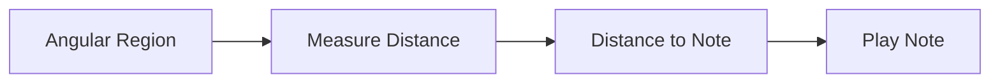
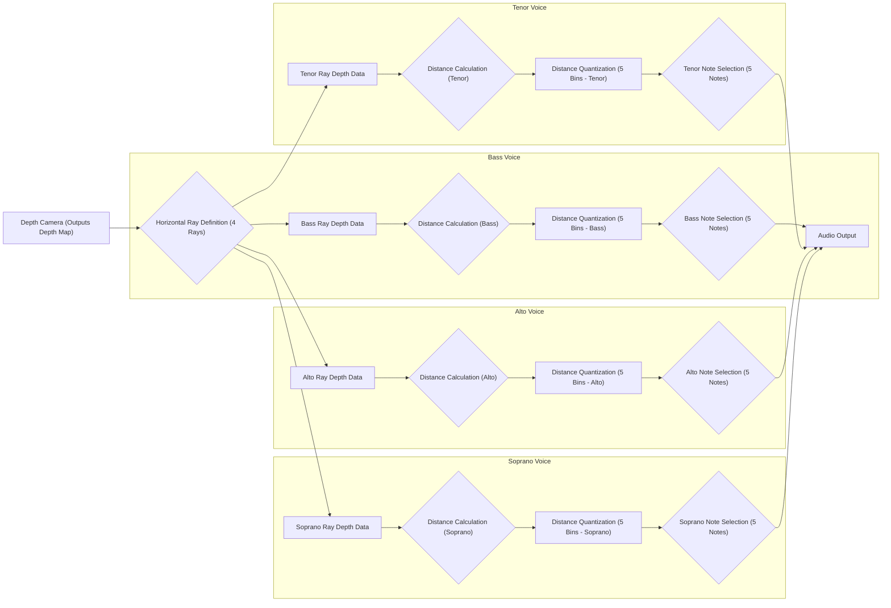
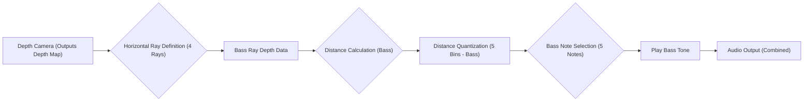

# RealSense Piano

Project to do something concrete with the Intel RealSense D435i.

Initial idea is to have a fixed D435i, and we detect an object in the scene closer than X, and we beep. But what if we extended to have 4 independent channels of sound?






Also using this to learn `uv` python management, see [here](https://docs.astral.sh/uv/concepts/projects/layout/#the-pyprojecttoml).

## Development Setup

### Dependencies
This project uses modern Python packaging with `pyproject.toml` and `uv`. 

```powershell
# Create and activate virtual environment
python -m venv .venv
.\.venv\Scripts\activate

# Install dependencies with uv
uv pip install -e .
```

To update dependencies:
```powershell
# Update lock file after changing pyproject.toml
uv pip compile pyproject.toml -o uv.lock

# Install from lock file
uv pip sync uv.lock
```

### Testing

First, generate synthetic test data:
```powershell
# Make sure you're in your virtual environment
.\.venv\Scripts\activate

# Generate test data
python -m scripts.generate_test_data
```

Test data will be saved to `data/test_sequences/four_sectors.pkl`. This synthetic data simulates four moving objects in alternating sectors (creating a four-key piano). Each object oscillates between 0.5m and 3.5m with different phases, allowing testing of both position and distance detection.

Run tests:
```powershell
# Run all tests without GUI
pytest -v

# Run specific tests with GUI visualization
pytest tests/test_bounding_box_detector.py -v --showgui

# Run tests with coverage report
pytest -v --cov=src
```


