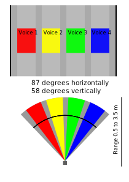

# Depth Camera Piano

Overall goal: do something interesting and concrete with the Intel RealSense D435i. Also using this to learn `uv` python management, see [here](https://docs.astral.sh/uv/concepts/projects/layout/#the-pyprojecttoml).


Using a fixed D435i and at least a 12ft x 12 ft area (3m x 3m), find the minimum distance of four zones in the field of view, and convert the distance value to a tone within a key. Now, we can extend that idea to detect four independent zones in parallel, and boom we have the ability to physically create four part harmony. The diagram shows the angular regions and how the camera would look in the central region and split the voices.



### Breaking down the problem 

Assume we use the `pyrealsense` to get a color and depth image from the D435i. The basic flow of the application looks like the following.


## Handout

See [the handout](./handouts/depth-camera-piano-handout.md) for instructions on how to setup the room and run the demonstration.

## Development Setup

### Dependencies
This project uses modern Python packaging with `pyproject.toml` and `uv`. Note: the pinned python version is specified by the `.python-version` file, set to 3.11, and uv should automatically detect, install, and install the python dependencies compatible with that python version.

```bash
# Install dependencies from lock file
uv sync

# Update lock file (after changing pyproject.toml)
uv lock
```

### Run the Application

```
uv run python src/piano/main.py
```