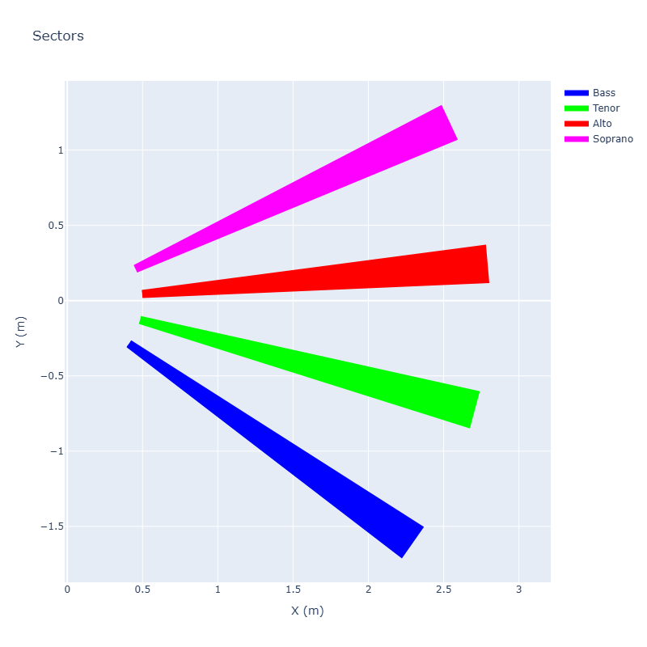

# Depth Camera Piano

Overall goal: do something interesting and concrete with the Intel RealSense D435i. Also using this to learn `uv` python management, see [here](https://docs.astral.sh/uv/concepts/projects/layout/#the-pyprojecttoml).


Using a fixed D435i and at least a 12ft x 12 ft area (3m x 3m), find the minimum distance of four zones in the field of view, and convert the distance value to a tone within a key. Now, we can extend that idea to detect four independent zones in parallel, and boom we have the ability to physically create four part harmony. The diagram shows the angular regions and how the camera would look in the central region and split the voices.


### Breaking down the problem 

Assume we use the `pyrealsense` to get a color and depth image from the D435i. The basic flow of the application looks like the following.


## Room Setup

A room with about 12ft by 12ft clearance is needed, and the camera should be mounted on a tripod or table that is about waist level. Each virtual ray is about 9ft (2.75 m), and will be divided into one octave (8 notes), meaning each note has a little over 1 ft of distance.


The top down plot can be used to markdown the floor with tape to help students know where the virtual ray. The camera is located at the (0,0) coordinate.




## Development Setup

### Dependencies
This project uses modern Python packaging with `pyproject.toml` and `uv`. 

```bash
# Install dependencies from lock file
uv sync

# Update lock file (after changing pyproject.toml)
uv lock
```

### Run the Application

```
uv run python src/piano/main.py
```