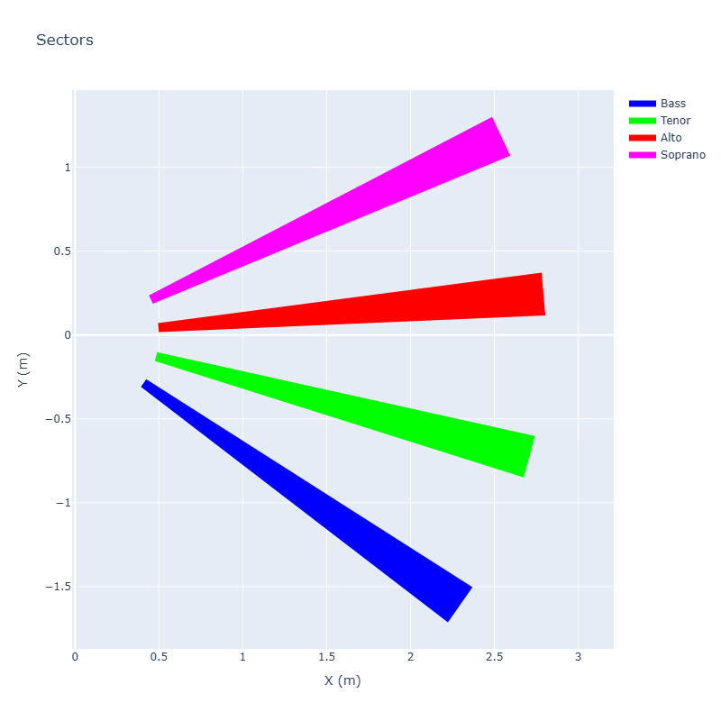

# Depth Camera Piano

## Hardware Required

This setup has been tested with the [Intel RealSense D435i depth camera](https://www.amazon.com/Intel-RealSense-Depth-Camera-D435i/dp/B07MWR2YJB/) and on a Windows laptop capable of running the Intel RealSense Viewer ([see the Assets](https://github.com/IntelRealSense/librealsense/releases/tag/v2.56.3)).

## Room Setup

A room with about 12ft by 12ft clearance is needed, and the camera should be mounted on a tripod or table that is about waist level. Each virtual ray is about 9ft (2.75 m), and will be divided into one octave (8 notes), meaning each note has a little over 1 ft of distance.

The top down plot can be used to markdown the floor with tape to help students know where the virtual ray. The camera is located at the (0,0) coordinate.

